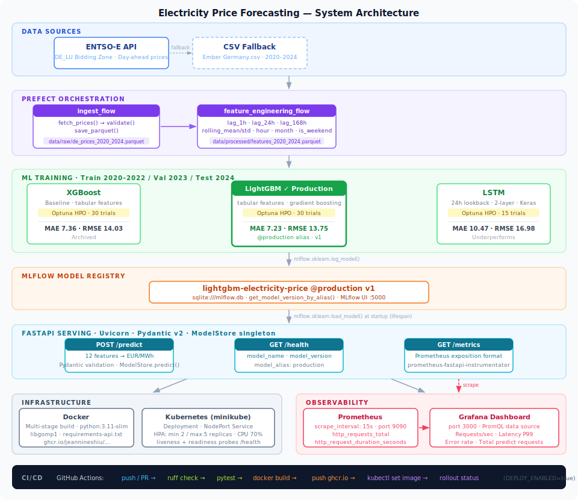
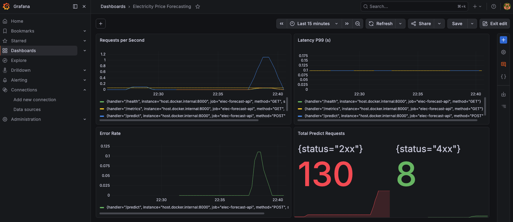

# Electricity Price Forecasting

An end-to-end MLOps project that forecasts German day-ahead electricity prices (EUR/MWh) using LightGBM and LSTM, served via a production-grade REST API with full CI/CD and observability.

---

## Business Value

Electricity prices in the European market are highly volatile — driven by renewable generation, cross-border flows, and demand spikes. Accurate short-term price forecasts enable:

- **Energy traders** to optimise buy/sell decisions in day-ahead markets
- **Industrial consumers** to shift flexible loads to low-price windows, reducing energy costs
- **Grid operators** to anticipate demand-supply imbalances before they occur
- **Renewable asset owners** to schedule battery dispatch and maximise revenue

This project targets the German bidding zone (DE_LU), one of the largest and most liquid electricity markets in Europe, using 5 years of hourly price data (2020–2024).

---

## Architecture



---

## Observability Dashboard



---

## Model Performance

| Model | Test MAE | Test RMSE | Test MAPE | Status |
|---|---|---|---|---|
| **LightGBM** | **7.23** | **13.75** | **37.79%** | ✅ Production |
| XGBoost | 7.36 | 14.03 | 39.78% | Archived |
| LSTM | 10.47 | 16.98 | 68.97% | — |

LightGBM selected for production. LSTM underperforms because lag and rolling features already encode temporal structure — a deliberate engineering decision documented in the experiment tracking.

---

## Tech Stack

| Layer | Technology |
|---|---|
| **Data ingestion** | ENTSO-E API (`entsoe-py`), CSV fallback |
| **Orchestration** | Prefect 3 |
| **Feature engineering** | Pandas — lag features, rolling stats, calendar features |
| **ML models** | LightGBM, LSTM (Keras), XGBoost baseline |
| **Hyperparameter tuning** | Optuna |
| **Experiment tracking** | MLflow (SQLite backend) |
| **Model registry** | MLflow Model Registry (alias-based promotion) |
| **API serving** | FastAPI + Uvicorn |
| **Containerisation** | Docker (multi-stage build) |
| **Orchestration (infra)** | Kubernetes (minikube), HPA |
| **CI/CD** | GitHub Actions — lint, test, build, push to GHCR |
| **Observability** | Prometheus + Grafana |
| **Testing** | pytest + httpx |
| **Linting** | Ruff |

---

## Models

| Model | Description |
|---|---|
| **XGBoost** | Baseline — tabular features, Optuna-tuned |
| **LSTM** | Sequence model — 24-hour lookback window, dual-layer, Optuna-tuned |
| **LightGBM** | Production model — tabular features, Optuna-tuned, promoted to `@production` alias |

**Features (12 total):** `lag_1h`, `lag_24h`, `lag_168h`, `rolling_mean_24h`, `rolling_std_24h`, `rolling_mean_168h`, `rolling_std_168h`, `hour`, `day_of_week`, `month`, `is_weekend`, `is_holiday`

**Train/Val/Test split:** 2020–2022 / 2023 / 2024

---

## Project Structure

```
.
├── api/                    # FastAPI application
│   ├── main.py             # App entrypoint, lifespan, endpoints
│   ├── model.py            # MLflow model loader (singleton)
│   └── schemas.py          # Pydantic request/response schemas
├── flows/                  # Prefect flows
│   ├── ingest.py           # Data ingestion (ENTSO-E API + CSV fallback)
│   └── features.py         # Feature engineering
├── training/
│   ├── train.py            # XGBoost / LightGBM / LSTM training + MLflow logging
│   └── evaluate.py         # Model evaluation
├── infra/
│   ├── k8s/                # Kubernetes manifests (Deployment, Service, HPA)
│   ├── prometheus/         # Prometheus scrape config
│   ├── grafana/            # Grafana dashboard JSON
│   └── docker-compose.monitoring.yml
├── scripts/
│   └── simulate_traffic.py # Traffic simulation for dashboard demo
├── tests/
│   └── test_api.py         # API unit tests (mocked MLflow)
├── Dockerfile              # Multi-stage build
├── requirements.txt        # Training dependencies
└── requirements-api.txt    # API-only dependencies
```

---

## Quick Start

### 1. Install dependencies

```bash
conda create -n elec-forecast python=3.11
conda activate elec-forecast
python -m pip install -r requirements.txt
```

### 2. Run ingestion flow

```bash
python flows/ingest.py
```

### 3. Run feature engineering

```bash
python flows/features.py
```

### 4. Train models

```bash
# Train all models
python training/train.py

# Train LightGBM only
python training/train.py --lgbm-only

# Train LSTM only
python training/train.py --lstm-only
```

### 5. Promote model to production

```python
from mlflow import MlflowClient
import mlflow

mlflow.set_tracking_uri("sqlite:///mlflow.db")
client = MlflowClient()
client.set_registered_model_alias(
    name="lightgbm-electricity-price",
    alias="production",
    version="1",
)
```

### 6. Start MLflow UI

```bash
python -m mlflow ui --backend-store-uri sqlite:///mlflow.db
```

### 7. Start API

```bash
python -m uvicorn api.main:app --reload
```

### 8. Run tests

```bash
python -m pytest tests/ -v
```

---

## API Reference

### `GET /health`

```json
{
  "status": "ok",
  "model_name": "lightgbm-electricity-price",
  "model_version": "1",
  "model_alias": "production"
}
```

### `POST /predict`

**Request:**
```json
{
  "lag_1h": 45.2,
  "lag_24h": 38.7,
  "lag_168h": 41.1,
  "rolling_mean_24h": 42.3,
  "rolling_std_24h": 8.1,
  "rolling_mean_168h": 40.5,
  "rolling_std_168h": 9.2,
  "hour": 14,
  "day_of_week": 1,
  "month": 6,
  "is_weekend": 0,
  "is_holiday": 0
}
```

**Response:**
```json
{
  "predicted_price_eur_mwh": 43.8,
  "model_name": "lightgbm-electricity-price",
  "model_version": "1"
}
```

Interactive docs: `http://127.0.0.1:8000/docs`

---

## Docker

```bash
docker build -t elec-price-api .
docker run -p 8000:8000 \
  -v $(pwd)/mlflow.db:/app/mlflow.db \
  -v $(pwd)/mlruns:/Users/<you>/Desktop/electricity-price-forecasting/mlruns \
  elec-price-api
```

---

## Kubernetes (minikube)

```bash
minikube start
minikube image load elec-price-api:latest
minikube mount $(pwd):/mnt/elec-forecast &

kubectl apply -f infra/k8s/
minikube service elec-forecast-api --url
```

---

## Observability

```bash
# Start Prometheus + Grafana
docker compose -f infra/docker-compose.monitoring.yml up -d

# Simulate realistic traffic
python scripts/simulate_traffic.py
```

| Endpoint | URL |
|---|---|
| Prometheus | http://localhost:9090 |
| Grafana | http://localhost:3000 (admin / admin) |
| API metrics | http://localhost:8000/metrics |

**Dashboard panels:** Requests/sec · Latency P99 · Error rate · Total predict requests

---

## CI/CD

GitHub Actions pipeline (`.github/workflows/ci-cd.yml`):

| Job | Trigger | Steps |
|---|---|---|
| **Lint & Test** | push / PR to main | Ruff lint → pytest |
| **Build & Push** | push to main | Build Docker image → push to GHCR |
| **Deploy** | push to main + `DEPLOY_ENABLED=true` | `kubectl set image` → rollout |

---

## Data Source

- **Primary:** [ENTSO-E Transparency Platform](https://transparency.entsoe.eu/) — Day-ahead prices, DE_LU bidding zone
- **Fallback:** Ember Climate hourly price CSV (2020–2024)
